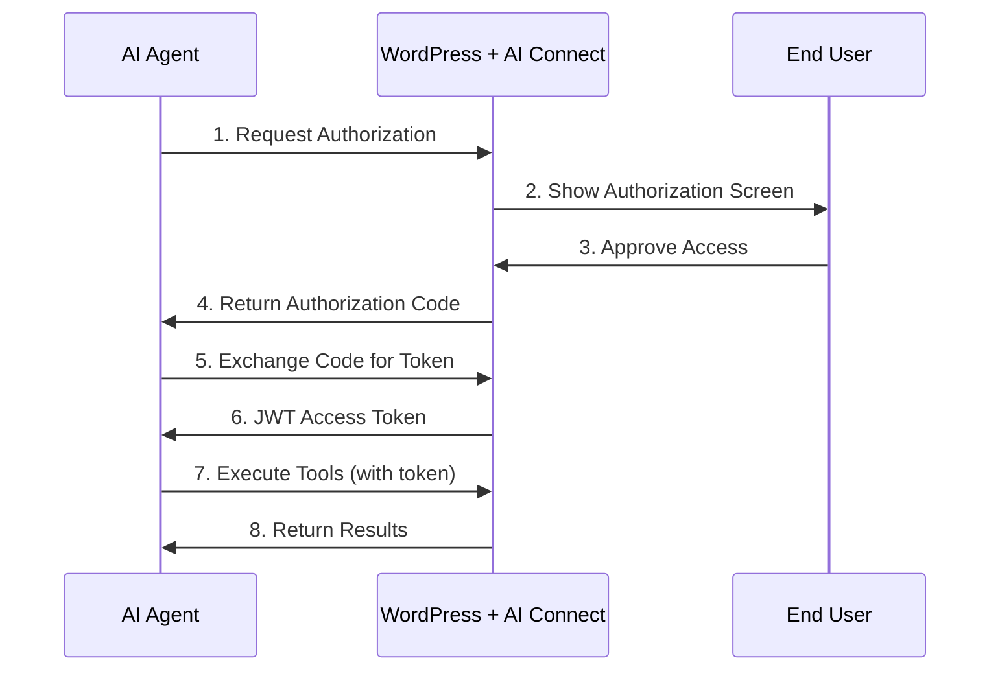

<div align="center">

# 🤖 AI Connect

**WebMCP Bridge for WordPress** - Make your WordPress site AI-ready in minutes

[](https://wordpress.org/)
[](https://www.php.net/)
[](LICENSE)

[Features](#features) • [Installation](#installation) • [Quick Start](#quick-start) • [Support](https://github.com/chgold/ai-connect/issues)

</div>

---

## 📖 Overview

Connect AI agents to your WordPress site using the **WebMCP protocol**. Enable AI-powered content management, user operations, and e-commerce automation through a secure OAuth 2.0 + JWT authentication system.

## ✨ Features

- ✅ **WebMCP Protocol Support** - Industry-standard AI integration
- ✅ **OAuth 2.0 + JWT Authentication** - Enterprise-grade security
- ✅ **Rate Limiting** - Redis-backed or WordPress transients
- ✅ **WordPress Core Tools** - Posts, Pages, Users (5 tools included)
- ✅ **Automatic Manifest Generation** - Zero configuration needed
- ✅ **Developer-Friendly** - Extensible module system
- 💎 **Pro Extensions Available** - WooCommerce, Forms, Analytics ([AI Connect Pro](https://github.com/chgold/ai-connect-pro))

## 🔄 How It Works

AI Connect acts as a bridge between AI agents and your WordPress site using the WebMCP protocol:



### Authentication Flow

1. **Authorization Request**: AI agent redirects user to your WordPress site
2. **User Consent**: User reviews and approves the requested permissions
3. **Authorization Code**: WordPress generates a single-use code
4. **Token Exchange**: AI agent exchanges code for JWT access token
5. **API Access**: AI agent uses token to execute tools and access data
6. **Token Refresh**: Long-lived refresh tokens for seamless re-authentication

## 📋 Requirements

- WordPress 6.0 or higher
- PHP 7.4 or higher
- Redis (optional, recommended for production)

## 📦 Installation

### From WordPress Admin

1. Download the latest release
2. Go to **Plugins → Add New → Upload Plugin**
3. Upload `ai-connect.zip`
4. Click **Install Now** and then **Activate**

### Manual Installation

```bash
cd /path/to/wordpress/wp-content/plugins/
git clone https://github.com/chgold/ai-connect.git
```

Then activate the plugin from WordPress admin. **No additional setup required** - all dependencies are included.

## 🚀 Quick Start

### 1. Create an OAuth Client

1. Go to **AI Connect → OAuth Clients** in WordPress admin
2. Click **Create New OAuth Client**
3. Enter:
   - **Client Name**: e.g., "My AI Agent"
   - **Redirect URI**: Your application's callback URL
4. Save the **Client ID** and **Client Secret** (shown only once!)

### 2. Authorize Your Application

Direct your users to the authorization URL:

```
GET /wp-json/ai-connect/v1/oauth/authorize
  ?client_id=YOUR_CLIENT_ID
  &redirect_uri=YOUR_REDIRECT_URI
  &response_type=code
  &scope=read write
  &state=RANDOM_STATE
```

### 3. Exchange Code for Access Token

```bash
curl -X POST https://yoursite.com/wp-json/ai-connect/v1/oauth/token \
  -H "Content-Type: application/json" \
  -d '{
    "grant_type": "authorization_code",
    "code": "AUTHORIZATION_CODE",
    "client_id": "YOUR_CLIENT_ID",
    "client_secret": "YOUR_CLIENT_SECRET"
  }'
```

Response:
```json
{
  "access_token": "eyJ0eXAiOiJKV1QiLCJhbGc...",
  "token_type": "Bearer",
  "expires_in": 3600,
  "refresh_token": "def50200...",
  "scope": "read write"
}
```

### 4. Use the API

```bash
curl -X POST https://yoursite.com/wp-json/ai-connect/v1/tools/wordpress.searchPosts \
  -H "Authorization: Bearer YOUR_ACCESS_TOKEN" \
  -H "Content-Type: application/json" \
  -d '{
    "search": "hello world",
    "limit": 5
  }'
```

> 💡 **New to AI Connect?** Check out the [complete AI assistant integration guide](#using-ai-connect-with-ai-assistants) at the end of this README for step-by-step instructions on connecting Claude, ChatGPT, and other AI agents.

## 🛠️ Available Tools

### WordPress Core (Free)

#### `wordpress.searchPosts`
Search WordPress posts with filters.

```json
{
  "search": "query",
  "category": "news",
  "tag": "updates",
  "status": "publish",
  "limit": 10
}
```

#### `wordpress.getPost`
Get a single post by ID or slug.

```json
{
  "identifier": 123
}
```

#### `wordpress.searchPages`
Search WordPress pages.

```json
{
  "search": "about",
  "limit": 10
}
```

#### `wordpress.getPage`
Get a single page by ID or slug.

```json
{
  "identifier": "about-us"
}
```

#### `wordpress.getCurrentUser`
Get current authenticated user info.

```json
{}
```

### 💎 Need More Tools?

**[AI Connect Pro](https://github.com/chgold/ai-connect-pro)** adds premium features:

- **WooCommerce Integration** - 15 tools for products, cart, orders, customers
- **Forms Integration** - Contact Form 7, Gravity Forms, WPForms support
- **Advanced Analytics** - Dashboard with usage metrics and insights
- **Priority Support** - Fast email and chat support

[Learn more about AI Connect Pro →](https://github.com/chgold/ai-connect-pro)

## ⚙️ Configuration

### Rate Limiting

Configure in **AI Connect → Settings**:

- **Per Minute**: Default 50 requests
- **Per Hour**: Default 1000 requests

Can be overridden via filters:

```php
add_filter('ai_connect_rate_limit_per_minute', function($limit) {
    return 100; // Increase to 100 req/min
});
```

### Redis Setup (Optional)

For production sites, Redis is recommended:

```php
// wp-config.php
define('REDIS_HOST', '127.0.0.1');
define('REDIS_PORT', 6379);
define('REDIS_PASSWORD', 'your-password'); // if needed
```

The plugin automatically falls back to WordPress transients if Redis is unavailable.

## 🔌 Extending with Custom Tools

AI Connect is built with extensibility in mind. You can easily add your own custom tools to expose any WordPress functionality to AI agents.

### Basic Custom Tool Example

```php
add_action('ai_connect_register_tools', function($manifest) {
    $manifest->register_tool('mysite.getStats', [
        'description' => 'Get website statistics including post count, user count, and comments',
        'input_schema' => [
            'type' => 'object',
            'properties' => [
                'include_drafts' => [
                    'type' => 'boolean',
                    'description' => 'Include draft posts in the count',
                    'default' => false
                ]
            ]
        ]
    ]);
});
```

### Handling Tool Execution

```php
add_filter('ai_connect_handle_tool', function($result, $tool_name, $args) {
    if ($tool_name === 'mysite.getStats') {
        $post_status = !empty($args['include_drafts']) ? ['publish', 'draft'] : ['publish'];
        
        return [
            'posts' => wp_count_posts()->publish,
            'pages' => wp_count_posts('page')->publish,
            'users' => count_users()['total_users'],
            'comments' => wp_count_comments()->approved
        ];
    }
    return $result;
}, 10, 3);
```

### Complete Working Example

```php
/**
 * Register custom tool for getting latest comments
 */
add_action('ai_connect_register_tools', function($manifest) {
    $manifest->register_tool('mysite.getLatestComments', [
        'description' => 'Retrieve the latest approved comments from the site',
        'input_schema' => [
            'type' => 'object',
            'properties' => [
                'limit' => [
                    'type' => 'integer',
                    'description' => 'Maximum number of comments to return',
                    'default' => 10,
                    'minimum' => 1,
                    'maximum' => 100
                ],
                'post_id' => [
                    'type' => 'integer',
                    'description' => 'Optional: Filter comments by post ID'
                ]
            ]
        ]
    ]);
});

/**
 * Handle the custom tool execution
 */
add_filter('ai_connect_handle_tool', function($result, $tool_name, $args) {
    if ($tool_name !== 'mysite.getLatestComments') {
        return $result;
    }
    
    // Input validation
    $limit = isset($args['limit']) ? absint($args['limit']) : 10;
    $limit = min(max($limit, 1), 100); // Clamp between 1-100
    
    // Query comments
    $comment_args = [
        'status' => 'approve',
        'number' => $limit,
        'orderby' => 'comment_date',
        'order' => 'DESC'
    ];
    
    if (!empty($args['post_id'])) {
        $comment_args['post_id'] = absint($args['post_id']);
    }
    
    $comments = get_comments($comment_args);
    
    // Format response
    return array_map(function($comment) {
        return [
            'id' => $comment->comment_ID,
            'post_id' => $comment->comment_post_ID,
            'author' => $comment->comment_author,
            'email' => $comment->comment_author_email,
            'content' => $comment->comment_content,
            'date' => $comment->comment_date,
            'post_title' => get_the_title($comment->comment_post_ID)
        ];
    }, $comments);
}, 10, 3);
```

### Security Considerations

When creating custom tools:

- ✅ **Validate all inputs** - Use `absint()`, `sanitize_text_field()`, `esc_url_raw()`, etc.
- ✅ **Check permissions** - Verify the authenticated user has appropriate capabilities
- ✅ **Limit output size** - Prevent excessive data transfer
- ✅ **Sanitize output** - Use `esc_html()`, `esc_attr()` for any user-generated content
- ✅ **Rate limit expensive operations** - Consider caching for database-heavy tools

### Tool Naming Conventions

- Use namespaced names: `mysite.toolName` or `myplugin.actionName`
- Keep names descriptive and action-oriented
- Use camelCase for consistency with built-in tools

## 🔒 Security

### How Authentication Works

**AI Connect uses user-delegated authentication.** This means the AI agent operates **as a specific WordPress user**, not as a separate superuser.

#### What This Means in Practice:

**When a user authorizes an AI agent:**
1. The user logs into WordPress during the OAuth flow
2. WordPress generates a JWT token containing that user's ID
3. Every API request from the AI agent runs **as that user**
4. The agent inherits **all permissions and limitations** of that user

#### Permission Examples by User Role:

**If an Administrator authorizes the agent:**
- ✅ Can see all posts (including drafts, private, scheduled)
- ✅ Can see all pages (all statuses)
- ✅ Can see all WooCommerce orders (from all customers)
- ✅ Can see all products (including drafts and out-of-stock)
- ✅ Full access to everything the admin can access

**If a Customer authorizes the agent:**
- ✅ Can see only published posts and pages
- ✅ Can see only THEIR OWN orders
- ✅ Can see only published products
- ❌ Cannot see drafts or private content
- ❌ Cannot see other customers' orders
- ❌ Cannot see administrative data

**If a Subscriber authorizes the agent:**
- ✅ Can see only published posts and pages
- ✅ Can see their own user profile
- ❌ Cannot see WooCommerce data (no shop access)
- ❌ Very limited permissions

#### Security Implications:

⚠️ **Important:** The AI agent is NOT a superuser. It's bound by WordPress's built-in user capabilities system.

✅ **Safe:** Ask customers to authorize with their own accounts
✅ **Safe:** Read-only operations with `read` scope
⚠️ **Caution:** Admin accounts should only authorize trusted AI agents
⚠️ **Caution:** `admin` scope gives full administrative access

**Recommended Practice:**
- Use `read` scope for most AI assistants (customer service, content discovery)
- Use `write` scope only for content creation bots (when implemented)
- Use `admin` scope only for administrative automation with trusted agents

### Best Practices

1. ✅ **Use HTTPS** in production
2. ✅ **Rotate secrets** regularly
3. ✅ **Monitor rate limits** 
4. ✅ **Review OAuth scopes** before authorizing
5. ✅ **Enable Redis** for better rate limiting
6. ✅ **Create separate OAuth clients** for different AI agents
7. ✅ **Revoke access** immediately if a client is compromised

### OAuth Scopes

- `read` - Read-only access to content (recommended for most use cases)
- `write` - Create and modify content (requires careful authorization)
- `admin` - Administrative operations (use only with trusted agents)

**Scope inheritance:** `admin` includes `write` and `read`. `write` includes `read`.

## 🔧 Troubleshooting

### REST API returns 404 or redirects to homepage

**Cause**: Permalink structure not properly initialized.

**Solution**:
```bash
# Via WP-CLI
wp rewrite flush

# Or manually in WordPress admin
Go to Settings → Permalinks → Click "Save Changes"
```

### Redis not working despite PHP extension being installed

**Cause**: PHP server started before Redis extension was loaded.

**Solution**:
```bash
# Restart your PHP server
# For PHP built-in server:
# Stop current server (Ctrl+C), then:
cd /path/to/wordpress
php -S 0.0.0.0:8888

# For PHP-FPM:
sudo service php7.4-fpm restart

# For Apache:
sudo service apache2 restart
```

### WooCommerce tools return errors despite WooCommerce being active

**Cause**: WooCommerce might not have been active when the plugin initialized.

**Solution**:
```bash
# Deactivate and reactivate AI Connect
wp plugin deactivate ai-connect
wp plugin activate ai-connect

# Or clear WordPress object cache
wp cache flush
```

### "Invalid client credentials"

**Cause**: Client ID or Client Secret is incorrect or has been regenerated.

**Solution**:
- Verify you're using the correct credentials (check AI Connect → OAuth Clients)
- Client secrets are only shown once during creation
- If lost, delete the client and create a new one

### "Rate limit exceeded"

**Cause**: Too many requests in a short time period.

**Solution**:
- Wait for the retry period (check `Retry-After` header in response)
- Increase limits in AI Connect → Settings
- Enable Redis for more accurate rate limiting

### "Token expired"

**Cause**: Access token has exceeded its 1-hour lifetime.

**Solution**:
Use the refresh token to obtain a new access token:

```bash
curl -X POST https://yoursite.com/wp-json/ai-connect/v1/oauth/token \
  -H "Content-Type: application/json" \
  -d '{
    "grant_type": "refresh_token",
    "refresh_token": "YOUR_REFRESH_TOKEN",
    "client_id": "YOUR_CLIENT_ID",
    "client_secret": "YOUR_CLIENT_SECRET"
  }'
```

### Debug Mode

Enable debug mode to get detailed error information:

```php
// wp-config.php
define('WP_DEBUG', true);
define('WP_DEBUG_LOG', true);
define('WP_DEBUG_DISPLAY', false);
```

Check logs at: `wp-content/debug.log`

### Still Having Issues?

- 🐛 [Report a bug](https://github.com/chgold/ai-connect/issues/new?labels=bug)
- 💬 [Ask a question](https://github.com/chgold/ai-connect/issues/new?labels=question)

## 📸 Screenshots

### 1. Dashboard - System Status

*Monitor your AI Connect installation status, check system requirements, and get quick access to setup steps.*

### 2. OAuth Clients Management

*Create and manage OAuth clients for your AI agents. Generate client IDs and secrets securely.*

### 3. Settings - Rate Limiting

*Configure rate limits to control API usage and protect your WordPress site from abuse.*

### 4. WebMCP Manifest

*Auto-generated WebMCP manifest that AI agents use to discover available tools and capabilities.*

### 5. API Response Example

*Example of a successful API response showing post search results with complete metadata.*

## 🤖 Using AI Connect with AI Assistants

This section provides detailed instructions for connecting various AI platforms to your WordPress site using AI Connect.

### Connecting Claude (Anthropic)

Claude can connect to your WordPress site through its custom tool integration:

1. **Create OAuth Client** (in WordPress):
   - Go to AI Connect → OAuth Clients
   - Create new client with redirect URI: `https://claude.ai/oauth/callback`
   - Save the Client ID and Client Secret

2. **Configure Claude**:
   - Open Claude conversation
   - Click the tools/integrations icon
   - Select "Add Custom Tool"
   - Enter your WebMCP manifest URL: `https://yoursite.com/wp-json/ai-connect/v1/manifest`

3. **Authorize Access**:
   - Claude will prompt for authorization
   - Enter your Client ID and Client Secret
   - Approve the requested permissions

4. **Start Using**:
   ```
   Claude, search for posts about "artificial intelligence" on my WordPress site
   ```

### Connecting ChatGPT (OpenAI)

ChatGPT Plus users can add custom actions:

1. **Create OAuth Client** (in WordPress):
   - Redirect URI: `https://chat.openai.com/aip/callback`

2. **Add Custom GPT Action**:
   - Create new GPT or edit existing one
   - Go to "Configure" → "Actions"
   - Import from URL: `https://yoursite.com/wp-json/ai-connect/v1/manifest`

3. **Configure Authentication**:
   - Authentication Type: OAuth
   - Client ID: [Your Client ID]
   - Client Secret: [Your Client Secret]
   - Authorization URL: `https://yoursite.com/wp-json/ai-connect/v1/oauth/authorize`
   - Token URL: `https://yoursite.com/wp-json/ai-connect/v1/oauth/token`

4. **Test Connection**:
   ```
   Get the latest 5 posts from my WordPress site
   ```

### Connecting Make.com (Integromat)

Automate workflows with Make.com:

1. **Create OAuth Client** (in WordPress):
   - Redirect URI: `https://www.make.com/oauth/cb/webhook`

2. **Create HTTP Module** (in Make):
   - Add "HTTP - Make a Request" module
   - Method: POST
   - URL: `https://yoursite.com/wp-json/ai-connect/v1/tools/wordpress.searchPosts`
   - Headers:
     - `Authorization`: `Bearer YOUR_ACCESS_TOKEN`
     - `Content-Type`: `application/json`

3. **Get Access Token**:
   - Use Make's OAuth 2.0 feature or
   - Get token via curl and store in Make's data store

### Connecting Zapier

Integrate with 5,000+ apps:

1. **Create OAuth Client**:
   - Redirect URI: `https://zapier.com/dashboard/auth/oauth/return/`

2. **Create Zap**:
   - Trigger: Your preferred app
   - Action: Webhooks by Zapier → POST
   - URL: `https://yoursite.com/wp-json/ai-connect/v1/tools/wordpress.searchPosts`
   - Headers: `Authorization: Bearer YOUR_ACCESS_TOKEN`
   - Body: JSON with tool parameters

### Connecting Custom Applications

For developers building custom integrations:

1. **Install a WebMCP Client Library**:
   ```bash
   # Node.js
   npm install webmcp-client
   
   # Python
   pip install webmcp-client
   ```

2. **Initialize Client**:
   ```javascript
   const WebMCP = require('webmcp-client');
   
   const client = new WebMCP({
     manifestUrl: 'https://yoursite.com/wp-json/ai-connect/v1/manifest',
     clientId: 'YOUR_CLIENT_ID',
     clientSecret: 'YOUR_CLIENT_SECRET'
   });
   ```

3. **Execute Tools**:
   ```javascript
   // Search posts
   const posts = await client.executeTool('wordpress.searchPosts', {
     search: 'hello world',
     limit: 10
   });
   
   // Get specific post
   const post = await client.executeTool('wordpress.getPost', {
     identifier: 123
   });
   ```

## 📝 Changelog

See [CHANGELOG.md](CHANGELOG.md) for a detailed version history.

**Latest Release: v0.1.0** (2026-02-10)
- Initial public release
- WebMCP protocol support
- OAuth 2.0 + JWT authentication
- 5 WordPress Core tools
- 5 WooCommerce tools (Coming Soon)
- Rate limiting with Redis support

## 🛠️ Development

### Contributing

```bash
# Clone repository
git clone https://github.com/chgold/ai-connect.git
cd ai-connect

# Run tests (coming soon)
composer test
```

### Project Structure

```
ai-connect/
├── includes/
│   ├── core/          # OAuth, JWT, Rate Limiter
│   ├── modules/       # WordPress Core, WooCommerce
│   └── api/           # REST endpoints
├── vendor/            # Dependencies (committed)
└── .wordpress-org/    # Screenshots for WordPress.org
```

## 💬 Support

- 🐛 [Report Issues](https://github.com/chgold/ai-connect/issues)

## 📄 License

GPL v3 or later. See [LICENSE](LICENSE) file.

## 👏 Credits

Created by [chgold](https://github.com/chgold)

---

**Made with ❤️ for the WordPress & AI community**
