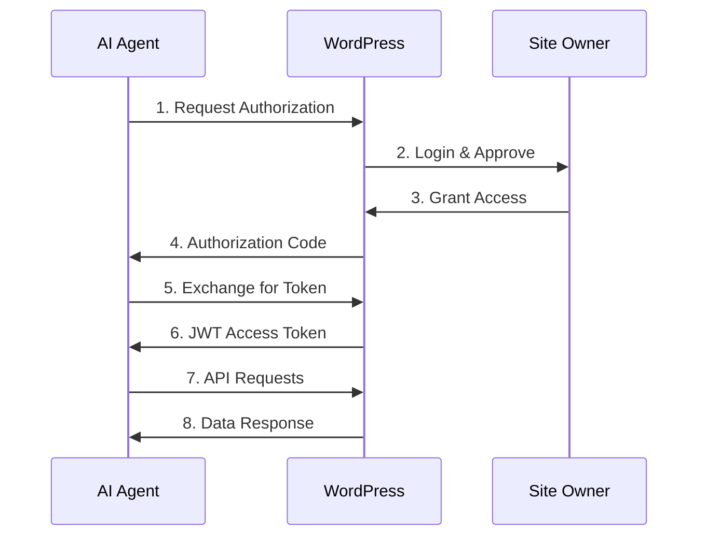

<div align="center">

# 🤖 AI Connect

**WebMCP Bridge for WordPress** - Connect AI agents to your WordPress site

[](https://wordpress.org/)
[](https://www.php.net/)
[](tests/)
[](LICENSE)

[Features](#features) • [Quick Start](#quick-start-for-ai-agents) • [Installation](#installation) • [Documentation](#documentation)

</div>

---

## 📖 Overview

AI Connect enables AI agents (like ChatGPT, Claude, and custom applications) to interact with your WordPress content through a secure OAuth 2.0 + JWT authentication system using the WebMCP protocol.

**Perfect for:** AI-powered customer support, automated content analysis, intelligent search, and custom AI integrations.

## ✨ Features

- ✅ **WebMCP Protocol Support** - Industry-standard AI integration
- ✅ **OAuth 2.0 + JWT Authentication** - Secure user-delegated access
- ✅ **5 WordPress Tools** - Search/get posts, pages, and user info
- ✅ **Rate Limiting** - Prevent abuse (50 req/min default)
- ✅ **Zero Configuration** - Works out of the box
- ✅ **Extensible** - Add custom tools via developer hooks
- ✅ **47 Tests Included** - Verified and production-ready

## 🎯 Quick Start for AI Agents

> **💡 Using an AI assistant?** Copy the text below and paste it into your AI agent (ChatGPT, Claude, etc.):

```
I want to connect you to my WordPress site using AI Connect.

Plugin Repository: https://github.com/chgold/wp-ai-connect
WebMCP Manifest: https://mysite.com/wp-json/ai-connect/v1/manifest

Please read the documentation from the GitHub repository above and help me set up the OAuth connection.
```

### Popular AI Platforms

<details>
<summary><b>🤖 ChatGPT (OpenAI)</b></summary>

**For ChatGPT Plus users with custom GPTs:**

1. Create or edit a GPT
2. Go to **Configure → Actions**
3. **Import from URL:** `https://yoursite.com/wp-json/ai-connect/v1/manifest`
4. **Authentication Type:** OAuth
5. **OAuth Settings:**
   - Client ID: `[Your Client ID]`
   - Client Secret: `[Your Client Secret]`
   - Authorization URL: `https://yoursite.com/wp-json/ai-connect/v1/oauth/authorize`
   - Token URL: `https://yoursite.com/wp-json/ai-connect/v1/oauth/token`
   - Scope: `read write`

**Test it:**
```
Get the latest 5 posts from my WordPress site
```

</details>

<details>
<summary><b>🧠 Claude (Anthropic)</b></summary>

**Claude supports custom tool integration:**

1. In Claude, click **Integrations**
2. Select **Add Custom Tool**
3. **Manifest URL:** `https://yoursite.com/wp-json/ai-connect/v1/manifest`
4. Enter your **Client ID** and **Client Secret**
5. Authorize access

**Test it:**
```
Claude, search my WordPress site for posts about "artificial intelligence"
```

</details>

<details>
<summary><b>🔧 Custom Applications</b></summary>

**Using cURL:**

```bash
# 1. Get authorization (opens browser)
https://yoursite.com/wp-json/ai-connect/v1/oauth/authorize?client_id=YOUR_CLIENT_ID&redirect_uri=YOUR_CALLBACK&response_type=code&scope=read&state=random123

# 2. Exchange code for token
curl -X POST https://yoursite.com/wp-json/ai-connect/v1/oauth/token \
  -H "Content-Type: application/json" \
  -d '{
    "grant_type": "authorization_code",
    "code": "AUTHORIZATION_CODE",
    "client_id": "YOUR_CLIENT_ID",
    "client_secret": "YOUR_CLIENT_SECRET"
  }'

# 3. Use the API
curl -X POST https://yoursite.com/wp-json/ai-connect/v1/tools/wordpress.searchPosts \
  -H "Authorization: Bearer YOUR_ACCESS_TOKEN" \
  -H "Content-Type: application/json" \
  -d '{"search": "hello world", "limit": 5}'
```

</details>

<details>
<summary><b>⚡ Make.com / Zapier</b></summary>

**Automate workflows:**

1. Create HTTP module in Make/Zapier
2. **Method:** POST
3. **URL:** `https://yoursite.com/wp-json/ai-connect/v1/tools/wordpress.searchPosts`
4. **Headers:**
   - `Authorization: Bearer YOUR_ACCESS_TOKEN`
   - `Content-Type: application/json`
5. **Body:** `{"limit": 10}`

</details>

---

## 🔄 How It Works



**Key Points:**
- ✅ **All API calls require OAuth authentication** (including read operations)
- ✅ **AI agent operates as the authorized user** (inherits their permissions)
- ✅ **Rate limiting protects your site** from abuse
- ✅ **Tokens expire after 1 hour** - use refresh token to get a new one

**Note:** Token refresh is NOT automatic. When the access token expires, the AI agent must use the refresh token to request a new access token.

---

## 📦 Installation

### From WordPress Admin

1. Download the [latest release](https://github.com/chgold/wp-ai-connect/releases)
2. Go to **Plugins → Add New → Upload Plugin**
3. Upload `ai-connect.zip`
4. Click **Install Now** and then **Activate**

### Manual Installation

```bash
cd /path/to/wordpress/wp-content/plugins/
git clone https://github.com/chgold/wp-ai-connect.git ai-connect
```

Then activate from WordPress Admin → Plugins.

**No configuration needed** - the plugin works immediately!

---

## 📋 Requirements

| Component | Required | Notes |
|-----------|----------|-------|
| WordPress | ✅ 6.0+ | Core requirement |
| PHP | ✅ 7.4+ | With json, openssl extensions |
| HTTPS | ⚠️ Production | Required for secure OAuth |
| Redis | ⭕ Optional | Recommended for high-traffic sites (>1000 req/day) |

### About Redis

**Redis is optional.** The plugin uses WordPress transients by default and works perfectly without Redis.

**When to use Redis:**
- High-traffic sites (>1,000 requests/day)
- Better rate limiting accuracy
- Improved performance

**How to install Redis:**
Redis must be installed at the server level (not through WordPress):

**Option 1: Server Administrator**
```bash
# Ubuntu/Debian
sudo apt-get install redis-server
sudo systemctl start redis

# macOS
brew install redis
brew services start redis
```

**Option 2: Managed Hosting**
- **WP Engine** - Redis included
- **Kinsta** - Redis included
- **Cloudways** - Redis as add-on
- **Shared hosting** - Usually not available

**The plugin automatically detects and uses Redis if available.**

---

## 🚀 Setup Guide

### Step 1: Create OAuth Client

1. Go to **AI Connect → OAuth Clients** in WordPress admin
2. Click **Create New OAuth Client**
3. Enter:
   - **Client Name:** e.g., "My AI Agent"
   - **Redirect URI:** Your application's callback URL (e.g., `https://app.com/callback`)
4. Click **Create**
5. **Save the Client ID and Client Secret** (shown only once!)

### Step 2: Share Credentials

Provide your AI agent with:
- **Manifest URL:** `https://yoursite.com/wp-json/ai-connect/v1/manifest` (public, no auth needed)
- **Client ID:** `client_xxxxx`
- **Client Secret:** `secret_xxxxx`

### Step 3: Test Connection

Visit your site's status endpoint to verify:
```
https://yoursite.com/wp-json/ai-connect/v1/status
```

Expected response:
```json
{
  "status": "ok",
  "version": "0.1.0",
  "tools_count": 5
}
```

---

## 🛠️ Available Tools

All tools require OAuth authentication with Bearer token.

### `wordpress.searchPosts`
Search WordPress posts with filters.

**Endpoint:** `POST /wp-json/ai-connect/v1/tools/wordpress.searchPosts`

**Request:**
```json
{
  "search": "artificial intelligence",
  "category": "tech",
  "tag": "ai",
  "status": "publish",
  "limit": 10
}
```

### `wordpress.getPost`
Get a single post by ID or slug.

**Endpoint:** `POST /wp-json/ai-connect/v1/tools/wordpress.getPost`

**Request:**
```json
{
  "identifier": 123
}
```

### `wordpress.searchPages`
Search WordPress pages.

**Endpoint:** `POST /wp-json/ai-connect/v1/tools/wordpress.searchPages`

**Request:**
```json
{
  "search": "about",
  "limit": 5
}
```

### `wordpress.getPage`
Get a single page by ID or slug.

**Endpoint:** `POST /wp-json/ai-connect/v1/tools/wordpress.getPage`

**Request:**
```json
{
  "identifier": "privacy-policy"
}
```

### `wordpress.getCurrentUser`
Get information about the authenticated user.

**Endpoint:** `POST /wp-json/ai-connect/v1/tools/wordpress.getCurrentUser`

**Request:**
```json
{}
```

**Returns:** User ID, username, email, roles, and capabilities.

**Note:** Returns info about whoever authorized the OAuth connection (not necessarily an admin).

---

## 🔒 Authentication & Security

### How User-Delegated Auth Works

**The AI agent operates as the user who authorized it:**

1. Site owner (e.g., Administrator) authorizes the AI agent
2. AI agent receives a token linked to that user's ID
3. All API requests run with that user's permissions

**Examples:**

**If Administrator authorizes:**
- ✅ Sees all posts (including drafts, private)
- ✅ Sees all pages (all statuses)
- ✅ Full access based on admin capabilities

**If Subscriber authorizes:**
- ✅ Sees only published posts/pages
- ✅ Can see their own profile
- ❌ Cannot see drafts or private content

**Security Note:** The AI agent is NOT a superuser. It respects WordPress user capabilities and permissions.

### Why OAuth for Read Operations?

**All API calls require authentication** (even for reading public content). This is intentional:

1. **Rate Limiting** - Prevents spam and abuse
2. **Monitoring** - Track who uses your API and how
3. **Security** - Protects against data scraping and DDoS
4. **Industry Standard** - Twitter, GitHub, Google APIs all require auth

**Exception:** The manifest endpoint is public (no auth):
```
GET /wp-json/ai-connect/v1/manifest
```

This allows AI agents to discover available tools before authenticating.

---

## 🗺️ Future Development

We're actively working on new features and improvements!

**We want your feedback:**
- 💡 What features do you need most?
- 🐛 Found a bug? Let us know!
- ⭐ Star features you want on GitHub

**How to provide feedback:**
- **Issues:** [Report bugs or request features](https://github.com/chgold/wp-ai-connect/issues/new)
- **Discussions:** Share ideas and use cases

Your feedback directly influences what we build next!

---

## 🔧 Troubleshooting

### REST API returns 404

**Cause:** Permalinks not flushed after activation.

**Solution:**
```bash
# Via WP-CLI
wp rewrite flush

# Or in WordPress admin
Settings → Permalinks → Click "Save Changes"
```

### "Invalid client credentials"

**Cause:** Client ID or Secret is incorrect.

**Solution:**
- Verify credentials in **AI Connect → OAuth Clients**
- Client secrets are only shown once during creation
- If lost, delete the client and create a new one

### "Rate limit exceeded"

**Cause:** Too many requests in a short time.

**Solution:**
- Wait for the retry period (check `Retry-After` header)
- Increase limits in **AI Connect → Settings**
- Consider enabling Redis for better rate limiting

### "Token expired"

**Cause:** Access token expired (1-hour lifetime).

**Solution:**
The AI agent must use the refresh token to get a new access token:

```bash
curl -X POST https://yoursite.com/wp-json/ai-connect/v1/oauth/token \
  -H "Content-Type: application/json" \
  -d '{
    "grant_type": "refresh_token",
    "refresh_token": "YOUR_REFRESH_TOKEN",
    "client_id": "YOUR_CLIENT_ID",
    "client_secret": "YOUR_CLIENT_SECRET"
  }'
```

**Note:** Token refresh is **not automatic**. The AI agent application must handle this.

**Still having issues?**
- 🐛 [Report a bug](https://github.com/chgold/wp-ai-connect/issues/new?labels=bug)
- 💬 [Ask a question](https://github.com/chgold/wp-ai-connect/issues/new?labels=question)

---

## 🧪 Testing

AI Connect includes comprehensive tests to ensure reliability.

**Run tests:**

```bash
cd /path/to/wordpress/wp-content/plugins/ai-connect

# Run all tests
./tests/test-both-configs.sh

# Unit tests
wp eval-file tests/run-tests.php

# HTTP integration tests
./tests/test-endpoints.sh

# Complete manifest validation
./tests/test-all-manifest.sh
```

**Test Coverage:**
- ✅ 47 passing tests
- ✅ OAuth flow validation
- ✅ All 5 API tools tested
- ✅ Manifest structure validation
- ✅ Rate limiting verification
- ✅ Error handling validation

**Note:** Tests are included in the GitHub repository for developers. End users downloading from WordPress.org do not receive the tests directory.

---

## 🔌 Developer Documentation

### Extending with Custom Tools

AI Connect is extensible! Add your own tools using WordPress hooks.

**Example: Add a custom statistics tool**

```php
// Register tool
add_action('ai_connect_register_tools', function($manifest) {
    $manifest->register_tool('mysite.getStats', [
        'description' => 'Get website statistics',
        'input_schema' => [
            'type' => 'object',
            'properties' => [
                'include_drafts' => [
                    'type' => 'boolean',
                    'description' => 'Include draft posts in count',
                    'default' => false
                ]
            ]
        ]
    ]);
});

// Handle execution
add_filter('ai_connect_handle_tool', function($result, $tool_name, $args) {
    if ($tool_name === 'mysite.getStats') {
        $post_status = !empty($args['include_drafts']) 
            ? ['publish', 'draft'] 
            : ['publish'];
        
        return [
            'posts' => wp_count_posts()->publish,
            'pages' => wp_count_posts('page')->publish,
            'users' => count_users()['total_users'],
            'comments' => wp_count_comments()->approved
        ];
    }
    return $result;
}, 10, 3);
```

**Security Best Practices:**
- ✅ Validate all inputs using WordPress sanitization functions
- ✅ Check user capabilities before executing sensitive operations
- ✅ Limit output size to prevent excessive data transfer
- ✅ Use WordPress escaping functions for user-generated content

**Available Hooks:**
- `ai_connect_register_tools` - Register custom tools
- `ai_connect_handle_tool` - Handle tool execution
- `ai_connect_token_expiry` - Modify token lifetime (default: 3600s)
- `ai_connect_rate_limit_per_minute` - Modify rate limit (default: 50)

---

## 📖 API Reference

### Endpoints

**Infrastructure:**
- `GET /wp-json/ai-connect/v1/status` - Health check
- `GET /wp-json/ai-connect/v1/manifest` - Tool discovery (public, no auth)

**OAuth:**
- `GET /wp-json/ai-connect/v1/oauth/authorize` - Authorization endpoint
- `POST /wp-json/ai-connect/v1/oauth/token` - Token exchange/refresh

**Tools:**
- `POST /wp-json/ai-connect/v1/tools/{tool_name}` - Execute tool (requires auth)

**Required Headers:**
```
Authorization: Bearer {access_token}
Content-Type: application/json
```

---

## 🤝 Contributing

**This project is not accepting code contributions at this time.**

However, we greatly appreciate:
- 🐛 **Bug reports** - Help us find and fix issues
- 💡 **Feature suggestions** - Tell us what you need
- 📖 **Documentation feedback** - Help us improve docs
- ⭐ **GitHub stars** - Show your support!

[Open an issue →](https://github.com/chgold/wp-ai-connect/issues/new)

---

## 📄 License

GPL v3 or later. See [LICENSE](LICENSE) file.

**Free and Open Source:** Use, modify, and distribute freely under GPL terms.

---

## 🙏 Acknowledgments

- Built with [firebase/php-jwt](https://github.com/firebase/php-jwt) for JWT handling
- Optional [predis/predis](https://github.com/predis/predis) for Redis support
- Compliant with [WebMCP protocol](https://webmcp.org) specification

---

<div align="center">

**Made with ❤️ for the WordPress & AI community**

[Documentation](https://github.com/chgold/wp-ai-connect) •
[Issues](https://github.com/chgold/wp-ai-connect/issues) •
[Discussions](https://github.com/chgold/wp-ai-connect/discussions)

</div>
